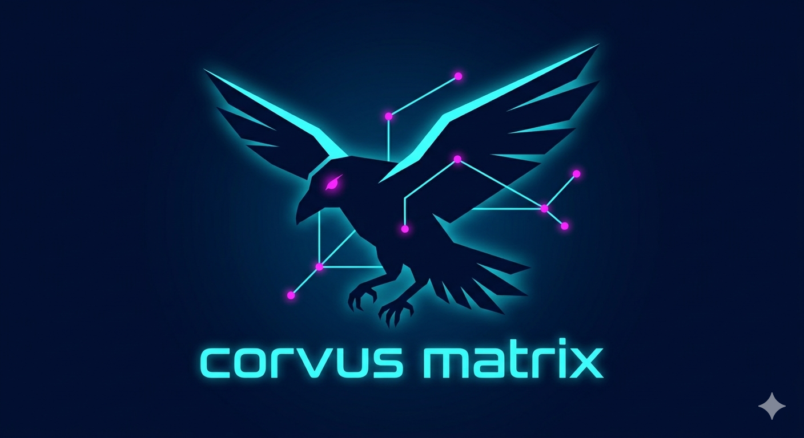

# 🦅 Crow Code



> Evidence-driven AI coding agent with sandboxed verification and structured patch plans.

**Crow Code** is an AI coding agent built by [CorvusMatrix](https://github.com/CorvusMatrix). Instead of letting a model write directly to your repository, Crow compiles model output into structured `AgentAction` / `IntentPlan` objects, rehydrates them against the current workspace, applies them inside an isolated sandbox, and verifies the result before any workspace write.

**Current reality:** the core local loop already works for repo mapping, structured reads and recon, plan hydration, sandbox apply, verification, sessions, provider routing, and MCP stdio transport. Some platform/product layers are still partial or experimental, especially replay/time-travel, richer intelligence/LSP work, and parts of the dashboard/dream story.

## Why Crow

- **Evidence over vibes.** Plans are judged with structured verification output, not just model confidence.
- **Patches are first-class.** The model proposes structured actions; it does not write arbitrary text straight to disk.
- **Snapshot-aware safety.** Plans are anchored to a workspace snapshot and hydrated with real file hashes before apply.
- **Workspace-write by default.** Crow defaults to a verified write path, not unrestricted full access.

## What works today

- Rust workspace probe and repo-map generation
- structured `read_files` and recon actions
- intent compilation into `AgentAction`
- plan hydration with ground-truth file hashes
- isolated sandbox materialization and patch application
- preflight compile checks and full verification runs
- session persistence and resume
- multi-provider LLM routing (OpenAI-compatible, Anthropic, Ollama, DeepSeek, custom)
- MCP stdio transport for external tools
- evidence-first `plan` preview mode

## Quick start

### Prerequisites

- Rust / Cargo
- an LLM provider configured via environment or `.crow/config.json`
- for the built-in recon tools, common local utilities such as `rg`, `tree`, `file`, `wc`, and `ls`

### 1) Build and test the workspace

```bash
cargo build --workspace
cargo test --workspace
```

### 2) Configure a provider

Minimal OpenAI-compatible example:

```bash
export OPENAI_API_KEY=...
export LLM_PROVIDER=openai
export LLM_MODEL=gpt-4-turbo
```

Anthropic / Ollama / DeepSeek are also supported via `LLM_PROVIDER`.

You can also use project-local or global config:

- local: `.crow/config.json`
- global: `~/.crow/config.json`

Example:

```json
{
  "llm": {
    "provider": "ollama",
    "model": "llama3",
    "base_url": "http://localhost:11434/v1"
  },
  "workspace": {
    "write_mode": "write",
    "map_budget": 65536
  }
}
```

### 3) Run the CLI

```bash
# Show help
cargo run -p crow-cli -- help

# Start interactive chat (also the default with no args)
cargo run -p crow-cli -- chat

# Compile a task into structured JSON only
cargo run -p crow-cli -- compile "Add a short note to README.md"

# Preview a plan plus evidence without applying it
cargo run -p crow-cli -- plan "Explain how this repo is organized"

# Run the full autonomous loop
cargo run -p crow-cli -- run "Fix a typo in README.md"
```

## Core commands

| Command | Purpose |
|---|---|
| `crow` / `crow chat` | Continuous chat REPL |
| `crow compile <prompt>` | Show the parsed `AgentAction` JSON |
| `crow plan <prompt>` | Preview a plan and evidence report |
| `crow run <prompt>` | Full autonomous loop |
| `crow dry-run <prompt>` | Alias for `run` |
| `crow session list` | List saved sessions |
| `crow session resume-run <id>` | Resume a saved session |
| `crow mcp` | Manage / use MCP tools |
| `crow dashboard` | Open the dashboard |
| `crow dream` | Run AutoDream memory consolidation |

## Safety model

Crow is trying to make the safe path the default:

- the model never writes to the workspace directly
- file mutations are expressed as structured plans
- plans are hydrated with real file hashes before apply
- changes are applied and tested inside a sandbox first
- default write mode is `workspace-write`, not unrestricted full access

### Current limitations

Crow is **not** a full OS-level sandbox yet. Repository isolation and verification are strong, but deep process/network isolation is still outside the current scope. Replay/time-travel infrastructure is also not complete yet.

## Architecture

Crow is a Rust workspace with 11 crates and strict layering:

```
L5  crow-cli   crow-replay   crow-mcp
L4  crow-brain
L3  crow-intel
L2  crow-verifier
L1  crow-workspace   crow-materialize
L0  crow-patch   crow-evidence   crow-probe
```

### Crate overview

| Crate | Layer | Purpose |
|-------|-------|---------|
| `crow-patch` | L0 | Patch contract: `AgentAction`, `IntentPlan`, `WorkspacePath` |
| `crow-evidence` | L0 | Verification evidence types |
| `crow-probe` | L0 | Workspace scanning and verification candidates |
| `crow-workspace` | L1 | Plan hydration, applier, and event-ledger groundwork |
| `crow-materialize` | L1 | Workspace-isolation materialization |
| `crow-verifier` | L2 | Isolated command execution and log truncation |
| `crow-intel` | L3 | Tree-sitter repo maps / outlines |
| `crow-brain` | L4 | Intent compiler, provider routing, MCTS, AutoDream |
| `crow-cli` | L5 | User-facing CLI binary |
| `crow-replay` | L5 | Replay harness (still minimal / planned) |
| `crow-mcp` | L5 | MCP stdio transport and client |

## Status

### Implemented

- workspace genesis and layered crate split
- core patch/evidence/probe contracts
- sandbox materialization
- verifier execution + ACI truncation
- autonomous compile / plan / run flow
- preflight compile checks
- session persistence and resume
- snapshot anchoring
- multi-provider routing
- MCP stdio transport

### Partial or still evolving

- replay harness
- richer event-ledger productization
- deeper intelligence/LSP integration
- dashboard / dream / long-horizon memory UX

See [`docs/RFC-001-Architecture-Baseline.md`](docs/RFC-001-Architecture-Baseline.md) for the architecture baseline and design goals.

## License

[MIT](LICENSE)